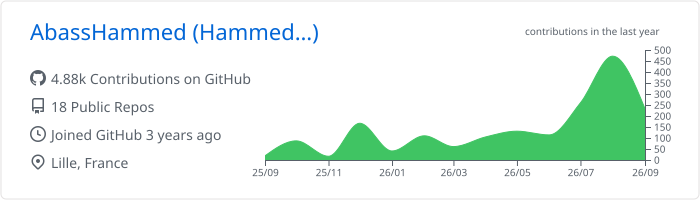
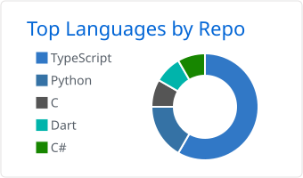
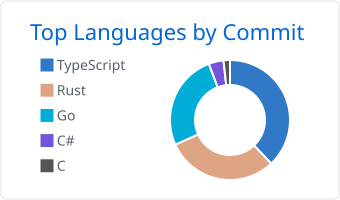
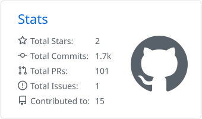
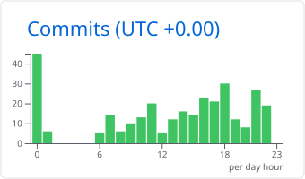
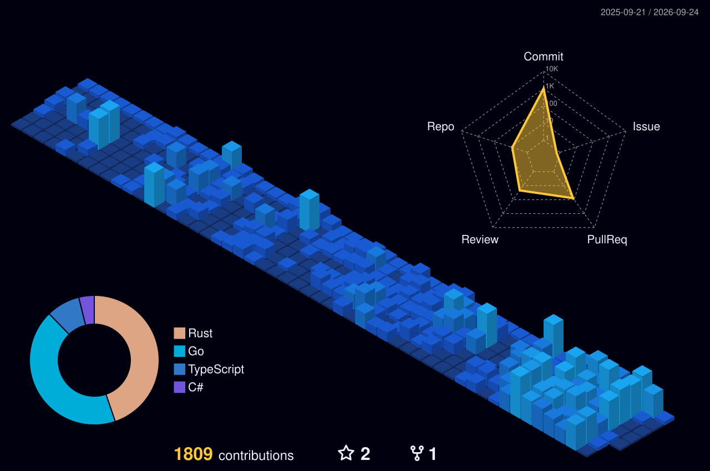

<h2 align="center">Hi, i'm Hammed</h2>

  <picture>
    <source media="(prefers-color-scheme: dark)" srcset="./profile-summary-card-output/github_dark/0-profile-details.svg">
    <source media="(prefers-color-scheme: light)" srcset="./profile-summary-card-output/github/0-profile-details.svg">
    
  </picture>

 

  <picture>
    <source media="(prefers-color-scheme: dark)" srcset="./profile-summary-card-output/github_dark/1-repos-per-language.svg">
    <source media="(prefers-color-scheme: light)" srcset="./profile-summary-card-output/github/1-repos-per-language.svg">
    
  </picture>
  <picture>
    <source media="(prefers-color-scheme: dark)" srcset="./profile-summary-card-output/github_dark/2-most-commit-language.svg">
    <source media="(prefers-color-scheme: light)" srcset="./profile-summary-card-output/github/2-most-commit-language.svg">
    
  </picture>

 

  <picture>
    <source media="(prefers-color-scheme: dark)" srcset="./profile-summary-card-output/github_dark/3-stats.svg">
    <source media="(prefers-color-scheme: light)" srcset="./profile-summary-card-output/github/3-stats.svg">
    
  </picture>
  <picture>
    <source media="(prefers-color-scheme: dark)" srcset="./profile-summary-card-output/github_dark/4-productive-time.svg">
    <source media="(prefers-color-scheme: light)" srcset="./profile-summary-card-output/github/4-productive-time.svg">
    
  </picture>

 

  <picture>
    <source media="(prefers-color-scheme: dark)" srcset="./profile-3d-contrib/profile-night-green.svg">
    <source media="(prefers-color-scheme: light)" srcset="./profile-3d-contrib/profile-green-animate.svg">
    
  </picture>

 

 

   
        

<h2 align="center">What I am listening to on Spotify now 🎧</h2>

